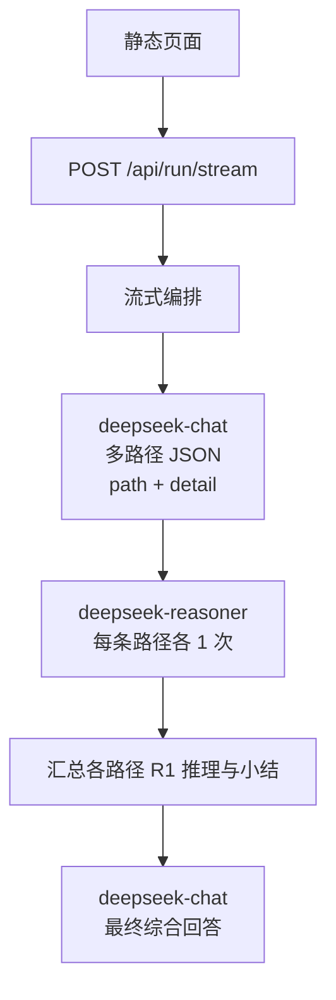

# 架构说明

## 技术栈

- Python 3.11+
- FastAPI + Uvicorn（HTTP API 与静态资源）
- OpenAI 兼容客户端调用 DeepSeek（`deepseek-chat` / `deepseek-reasoner`）
- 前端：原生 HTML/CSS/JS，默认调用 `POST /api/run/stream`（NDJSON 逐行事件）；**对比模式**下 `merge_async_dict_streams` 合并「基线 R1 流」与「技术侧流」；技术侧在路径列表就绪后通过 **asyncio 并行任务** 同时拉取多条路径的 R1 流，经队列交错下发。正文使用 **marked + DOMPurify**（CDN）做 Markdown 渲染。`POST /api/run` 仍保留为非流式整包 JSON。

## 数据流

### 技术模式（多阶段）

1. **路径生成（Chat）**：`deepseek-chat` 输出 **6～12 条**思考路径；每条含 `path`（短标题）与 `detail`（简洁但要详细的具体阐明）。
2. **分路径推理（R1）**：对**每一条**路径单独调用 `deepseek-reasoner`，只围绕该路径深度推理并给出该路径下的小结要点。
3. **综合回答（Chat）**：将各路径的 R1 推理过程与小结拼入上下文，由 `deepseek-chat` 输出**唯一**最终用户回答。

### 基线模式

用户问题直接进入 `deepseek-reasoner` 单次调用，无路径预处理与综合阶段。

## 目录结构

| 路径 | 职责 |
|------|------|
| `main.py` | 启动 Uvicorn |
| `src/deepthink_agent/config.py` | 环境变量与设置 |
| `src/deepthink_agent/prompts.py` | 系统/用户提示模板（分隔符、角色、输出约束） |
| `src/deepthink_agent/deepseek_client.py` | AsyncOpenAI 封装 |
| `src/deepthink_agent/services.py` | 路径生成、R1 调用、模式编排 |
| `src/deepthink_agent/web/app.py` | FastAPI 应用与路由 |
| `static/` | 前端资源 |
| `tests/` | 单测 |

## 横切关注点

- **密钥**：仅通过环境变量读取，禁止写入仓库。
- **错误**：外部 API 失败时返回明确 JSON 错误信息。
- **reasoner 参数**：不对 `deepseek-reasoner` 传入不支持的采样参数（如 temperature）。

## 质量

- `ruff check` / `ruff format`
- `pytest` 覆盖提示词契约与 API 层（可 mock 客户端）
